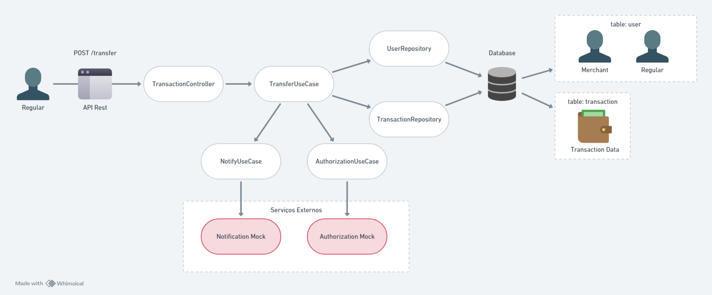

# Desafio Backend: Picpay Simplificado 💵

Essa é a minha proposta de solução para o desafio popular da entrevista da vaga de desenvolvedor do Picpay.

Em resumo, o desafio técnico proposto envolve o desenvolvimento de uma aplicação que simula um sistema simplificado de transferência de dinheiro entre dois tipos de usuários: comuns e lojistas.

## O que é o desafio?

O desafio encontrado no GitHub do PicPay, originalmente parte do processo de entrevista para a vaga de analista na empresa, ganhou popularidade na internet.

Desde então, sua resolução se tornou uma excelente maneira de aplicar conceitos de API Rest e explorar tecnologias backend. Por isso, decidi resolvê-lo para treinar minhas habilidades.

O desafio pode ser encontrado aqui: [Desafio Backend PicPay](https://github.com/PicPay/picpay-desafio-backend)

## Requisitos da Aplicação ✅

Esses foram os requisitos definidos no enunciado original.

### Usuários

* Existem dois tipos de usuário: comum e lojista.
* Usuário deve ter **nome completo**, **CPF**, **e-mail** e **senha** para ambos os tipos de usuários (comuns e lojistas).
* Os campos CPF/CNPJ e e-mail devem ser únicos.

### Transferências de Dinheiro

* Usuários comuns e lojistas podem enviar dinheiro para outros usuários e lojistas.
* Lojistas apenas recebem transferências e não podem enviar dinheiro.
* É necessário validar o saldo do usuário antes da transferência.

### Tratamento de Transações

* As transferências devem ser tratadas como transações, revertendo em qualquer caso de inconsistência e devolvendo o dinheiro para a carteira do usuário que enviou.

### Autorização de Transferência

* Consultar um mock de serviço autorizador externo antes de finalizar a transferência

### Notificação de Pagamento

* Usar um mock de serviço de notificação externo para simular o envio de notificações para usuário ou lojista que recebeu o pagamento.

### Serviço RESTful

* Desenvolvimento de um serviço RESTful para toda a aplicação.

## Solução

Com base no enunciado, escolhi utilizar o framework Spring do Java para desenvolver a solução.

Estruturei o projeto seguindo a Arquitetura Hexagonal. Assim, a lógica de negócios fica no domínio e as conexões com bancos de dados e serviços externos, como os mocks e o Kafka, na camada de infraestrutura.

Essa abordagem mantém o código organizado e facilita a manutenção e evolução do sistema.

A escolha do banco de dados H2 e do Spring Data JPA para este projeto foi motivada por razões como: O H2 é um banco de dados em memória, o que significa que ele é criado e preenchido cada vez que a aplicação é iniciada, e deletado quando a aplicação é encerrada. Além disso, o Spring Data JPA define repositórios para entidades, que fornecem operações comuns de banco de dados.
Ainda, H2 e Spring Data JPA tem uma configuração simplificada e funcionam bem juntos.

Por fim, é importante ressaltar que os usuários estão sendo inseridos diretamente no banco, porque não era um requisito do desafio original. A inserção está no script **data.sql**, e seus ids são gerados automaticamente. Então, uma nova feature a ser implantada é o sistema de cadastro de usuários.

```SQL
INSERT INTO users (fullname, cpf, email, password, balance, UserTypeEnum) VALUES ('Pamela', '123.456.789-00', 'pamela@hotmail.com', '123', 100.0, 'REGULAR');

INSERT INTO users (fullname, cpf, email, password, balance, UserTypeEnum) VALUES ('Crystal', '123.456.783-00', 'crystal@hotmail.com', '123', 200.0, 'MERCHANT');
```

### Tecnologias 💻

* Java
* Spring Boot
* Spring Data JPA
* H2
* Apache Kafka
* Docker
* Arquitetura Hexagonal

### Diagrama de Contexto

Abaixo é possível entender o fluxo da aplicação de maneira simplificada.



### Endpoints

```java
POST /transfer
//Realiza nova transferência
Content-Type: application/json

{
  "payerId": 1,
  "payeeId": 2,
  "value": 10.0
}
```

```java
GET /history
//Lista histórico de transferências
```

```java
GET /users
//Lista usuários cadastrados

// É importante ressaltar que o cadastro de usuários está sendo feito diretamente no arquivo data.sql. 
```

### Como executar

* Clonar repositório git:

`
git clone https://github.com/mendespann/picpay-simplificado.git
`

* Iniciar Kafka

`
docker-compose up
`

* Executar a aplicação Spring Boot

* **Enviar os endpoint no postman:**

Para criar nova transferência:

POST:
`
localhost:8080/transfer
`

Para ver histórico de transferências:

GET:
`
localhost:8080/history
`

Para ver usuários cadastrados:

GET:
`
localhost:8080/users
`

## Próximos passos

* Criar sistema de cadastro de usuários
* Trocar banco em memória
